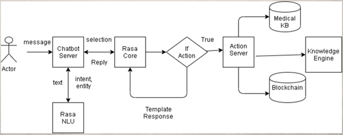
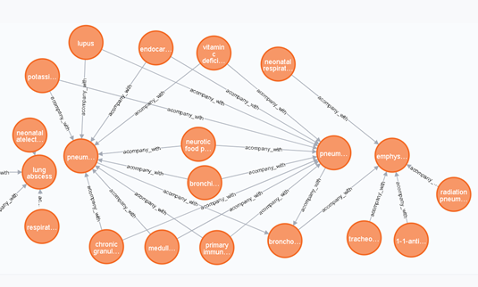
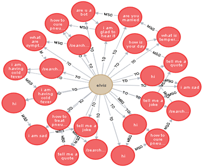
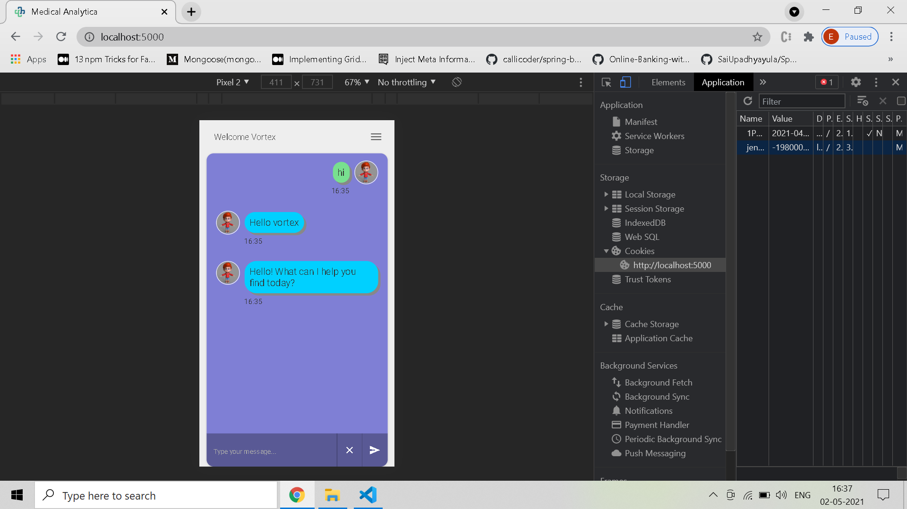
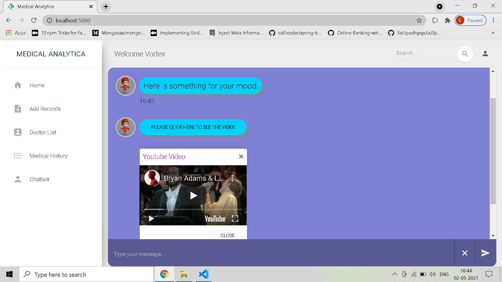
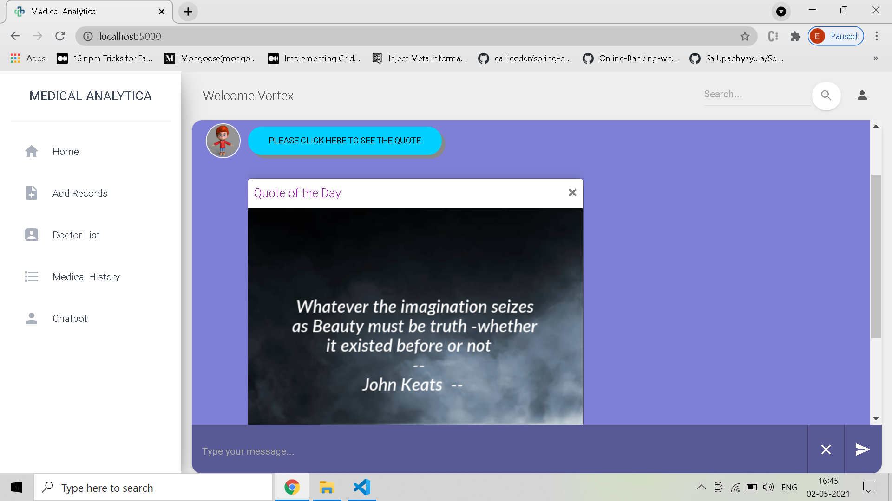

# Medical Analytica
A Medical bot with emotional analysis and casual chat

# Table of Contents

* [Description](https://github.com/ejson03/Medical-Chatbot#description)
* [Installation](https://github.com/ejson03/Medical-Chatbot#installation)
* [Output](https://github.com/ejson03/Medical-Chatbot#output)
* [Contributors](https://github.com/ejson03/Medical-Chatbot#contributors)
* [License](https://github.com/ejson03/Medical-Chatbot#license)

# Description

There is a wave of emotional unstabiltiy among people who are on a downward spiral in life or are going through hard times. We have developed a chat companion to make the user feel better and to track analysis of users behaviour. Chatbot as a compnion can provide you factual informatio

This project as a chatbot is a part of our complete project 

[Medical Analytica](https://github.com/ejson03/Medical-Analytica)

# Installation

Clone the repository
```
git clone https://github.com/ejson03/Medical-Analytica.git
```

## Run chatbot and ui on local
Setup Python environment
```
python -m venv venv

[Windows users]
.\venv\Scripts\activate

[Ubuntu]
source venv/bin/activate

pip install -r requirements.txt

python -m spacy download en_core_web_md
```

Setup Docker environment
```
docker-compose up -d --build mongodb neo4j
```

Inject data in neo4j
```
cd QA-engine/Knowledge-Base
python build_mdeicalgraph.py
```

For training and testing
```
cd chatbot
rasa train
rasa test
```

Running in one command on windows machine
```
./runserver.bat
```

## Run everything on docker

```
docker-compose up -d --build main
```


Essential docker commands
```
docker build -t <container-name> .
docker run -t <container-name> -p <port>:<port> [ -d for silent]
docker system prune -a (remove all containers)
docker ps (check running containers)
docker stop <container-id>  (stop single container)
docker rm <container-id> (remove single container)
docker rmi <image-id> (remove image)
docker container stop $(docker container ls -aq) (stop all containers)
docker container rm $(docker container ls -aq) (remove all containers)
docker container inspect <container-id>
```
# Output

## Chatbot architecture simple


## Medical Knowledge Graph


## User Knowledge Graph


## Mobile responsive


## Video Embedded


## Quote Embedded


# Contributors

* Elvis Dsouza [@ejson03](https://github.com/ejson03)
* Vedant Sahai [@Vedantsahai18](https://github.com/Vedantsahai18)
* Pratik Chowdhury [@pratikpc](https://github.com/pratikpc)

# License

[](https://opensource.org/licenses/MIT)

[MIT License Link](https://github.com/ejson03/Medical-Analytica/blob/master/LICENSE)


