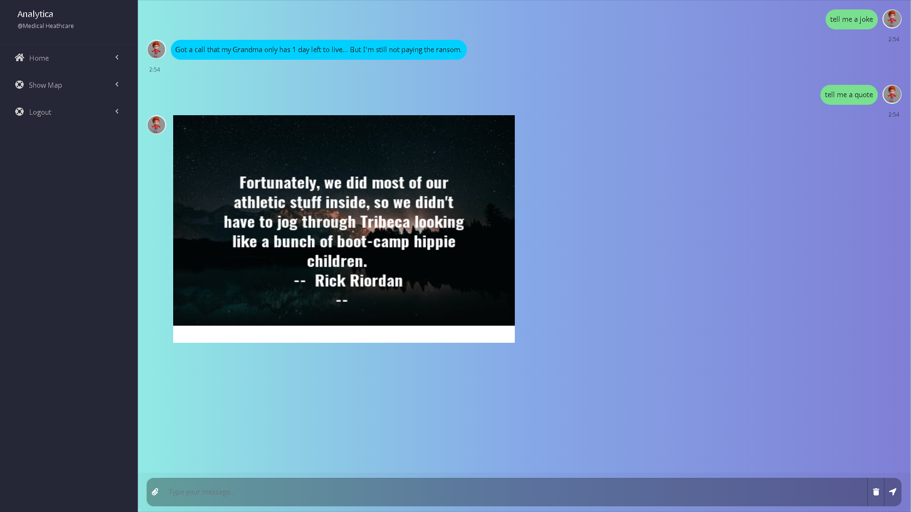
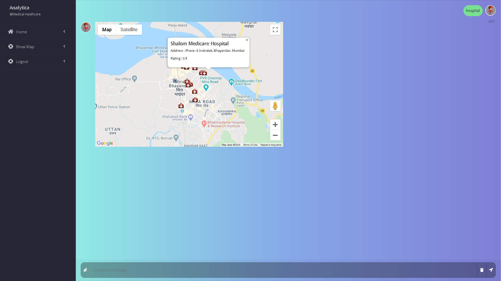
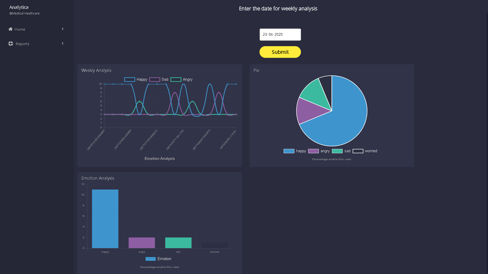

# Medical Analytica
A therapy based chatbot for emotion analysis and visualization

# Table of Contents

* [Description](https://github.com/ejson03/Medical-Analytica#description)
* [Dependencies](https://github.com/ejson03/Medical-Analytica#dependencies)
* [Installation](https://github.com/ejson03/Medical-Analytica#installation)
  * [Prerequisites](https://github.com/ejson03/Medical-Analytica#prerequisites)
  * [Instructions](https://github.com/ejson03/Medical-Analytica#instructions)
* [Usage](https://github.com/ejson03/Medical-Analytica#usage)
* [Contributors](https://github.com/ejson03/Medical-Analytica#contributors)
* [License](https://github.com/ejson03/Medical-Analytica#license)

# Description

There is a wave of emotional unstabiltiy among people who are on a downward spiral in life or are going through hard times. We have developed a chat companion to make the user feel better and to track analysis of users behaviour. Chat endpoints have been secured using jwt and the website is provided with SSL feature.


### Chatbot replying with a joke & quote


### Chatbot playing a youtube music video based on user emotion


### Chatbot displaying neaby hospitals with information


### Organization can keep record of patients weekly analysis


Additional features include weather reporting, symptoms checker and analysis

# Dependencies

* [Rasa](https://rasa.com/)
* [MongoDB](https://www.mongodb.com/)
* [Flask](https://flask.palletsprojects.com/en/1.1.x/)
* [Python](https://www.python.org/)


# Installation

### Prerequisites
Install Python and MongoDB from the above links

### Instructions

Clone the repository
```
git clone https://github.com/ejson03/Medical-Analytica.git
```

Setup Python environment
```
python -m venv venv

[Windows users]
.\venv\Scripts\activate

[Ubuntu]
source venv/bin/activate

pip install -r requirements.txt
```

For training and testing
```
cd chatbot
rasa train
rasa test
```

Running in one command on windows machine
```
python setup-windows.py
```

Generating ssl certificates for docker app
```
openssl genrsa 2048 > server.key
chmod 400 host.key
openssl req -new -x509 -nodes -sha256 -days 365 -key server.key -out server.crt
```

Setup Docker environment
```
docker-compose up --build
```

Essential docker commands
```
docker build -t <container-name> .
docker run -t <container-name> -p <port>:<port> [ -d for silent]
docker system prune -a (remove all containers)
docker ps (check running containers)
docker stop <container-id>  (stop single container)
docker rm <container-id> (remove single container)
docker rmi <image-id> (remove image)
docker container stop $(docker container ls -aq) (stop all containers)
docker container rm $(docker container ls -aq) (remove all containers)
docker container inspect <container-id>
```

# Usage

Open a browser and go to 
```
http://localhost:5000 (Windows users)
https://<docker-ip>:5000 (docker users)
```
# Contributors

* Elvis Dsouza [@ejson03](https://github.com/ejson03)
* Vedant Sahai [@Vedantsahai18](https://github.com/Vedantsahai18)

# License

[](https://opensource.org/licenses/MIT)

[MIT License Link](https://github.com/ejson03/Medical-Analytica/blob/master/LICENSE)


